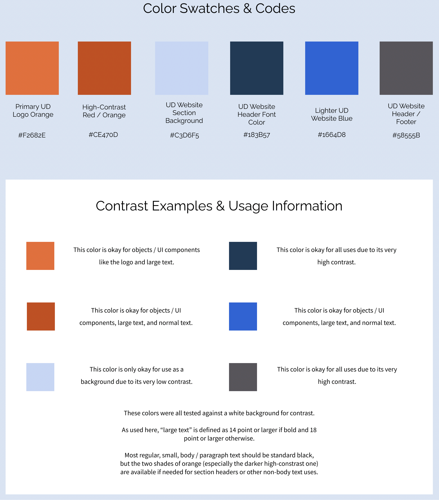
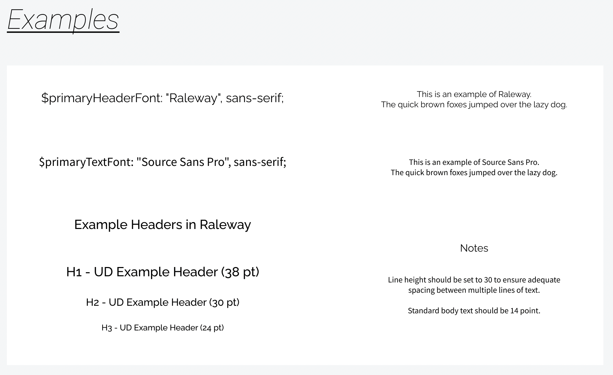
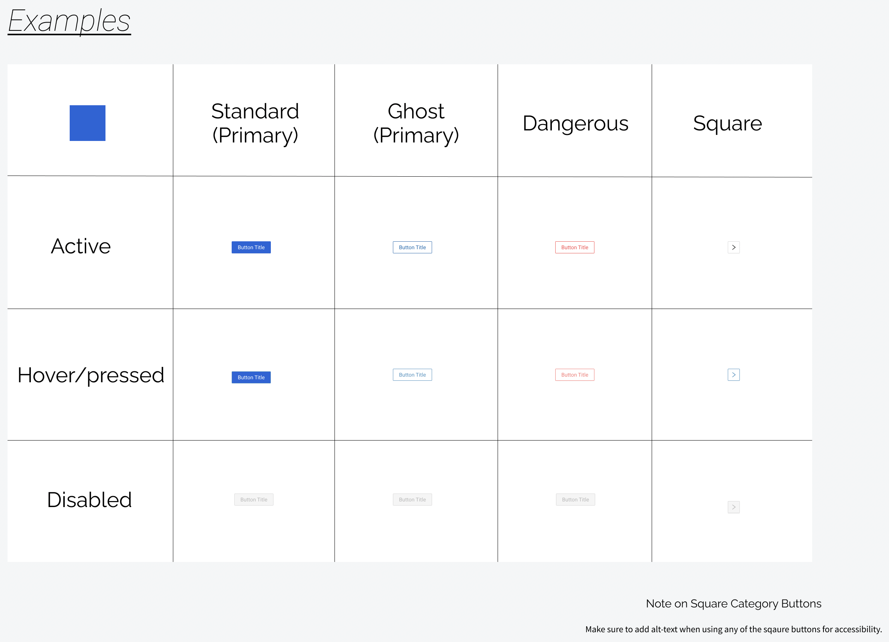
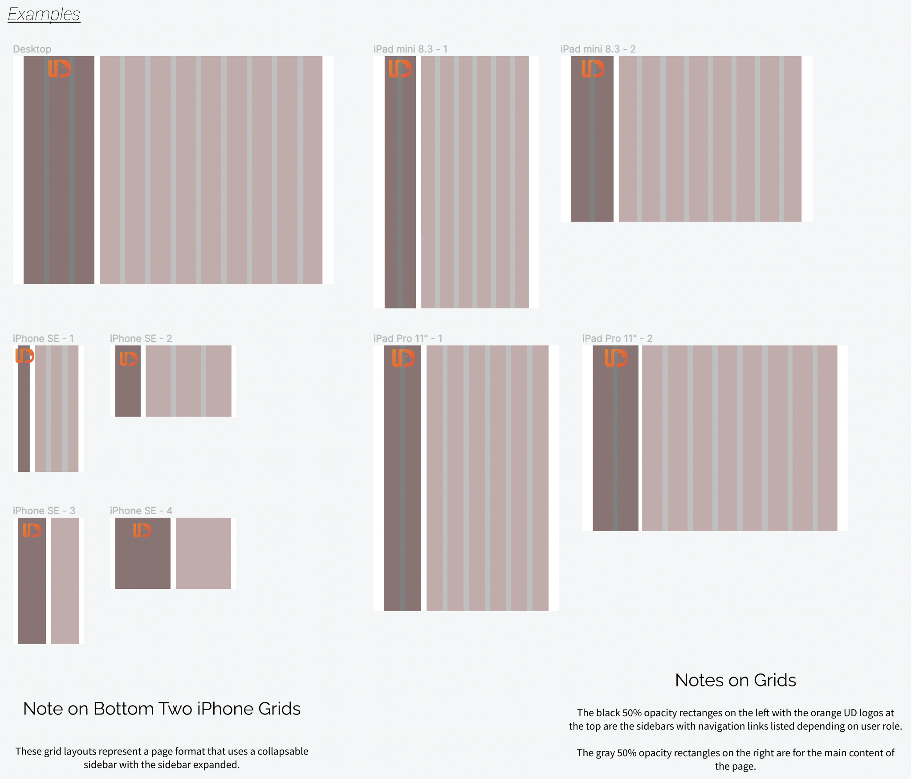

# UI Kit

To provide reference design materials and standardize elements across the app, we created a basic UI kit initially consisting of four pages in an updated Figma file.

The four pages are palettes (colors), typography (fonts), buttons, and grids.

### Colors / Palettes

Here's the colors / palettes page. We added six color swatches matched to the exact colors from the current UD marketing website, with one exception. The primary UD logo orange did not pass all contrast tests for accessibility, so we created a new darker shade labeled "high-contrast" that has sufficient contrast for all use cases.

We included hexadecimal color codes for easy reference, and usage information for each color specifying which use cases are appropriate based on our contrast tests for accessibility. We also included three helpful explanatory notes to add context.

#### Note on Colors for Text

Although most standard (small / body) text is expected to be black, we included usage information for both small and normal text in our descriptions to account for the case of the six colors being used for some other type of text, perhaps as section headers or page titles.

### Typography / Fonts

Here's the typography / fonts page. We reduced the original six fonts for the project to just two: Raleway for headings and Source Sans Pro for regular text. We included examples of both and two helpful explanatory notes to add context.

For the headings, we included three examples: an H1, a H2, and a H3. We also specified the sizes for each in points.

### Buttons

Here's the buttons page. We added a self-serve table where teammates can grab the button(s) they need by combining the category (one of the four columns) and the state / type (one of the three rows). We also included an explanatory note reminding teammates to add alt text for accessibility when using the small square buttons.

The blue color swatch in the upper left corner of the table is there to signify that the two relevant standard (primary) category buttons (the active and hover / pressed variants) have already been color matched to the exact brighter blue specified on the colors page. They do not need to have their fill color modified, and can be used as-is.

### Grids

Here's the grids page. Although we are currently focused on desktop for MVP, we included portrait and landscape grids for both a small and a large tablet, and two layout options for mobile. We also included three explanatory notes to provide context.

All nine grids follow the same pattern of a narrower black translucent rectangle on the left representing the sidebar with navigation links and the orange UD logo at the top, and a wider gray translucent rectangle on the right representing the main content of the page.
