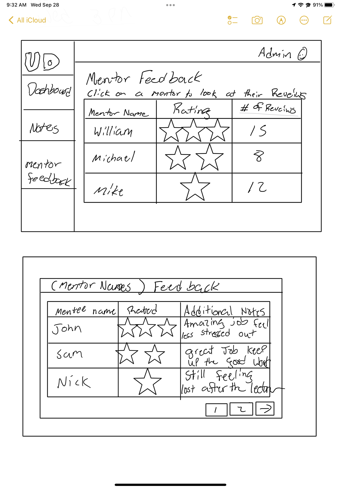
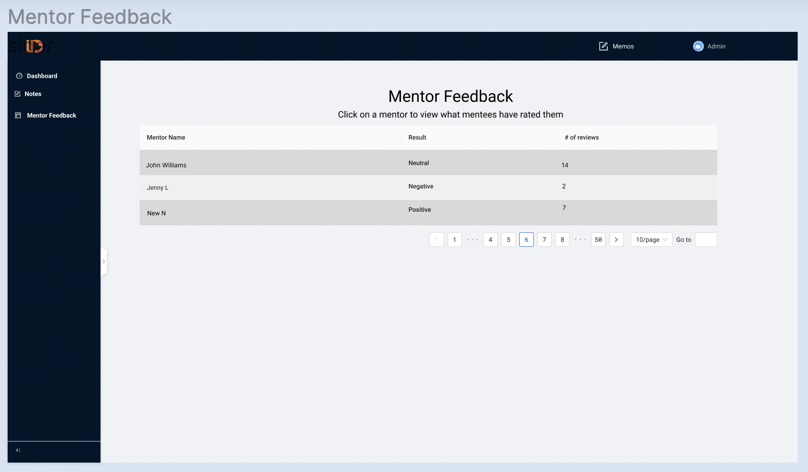
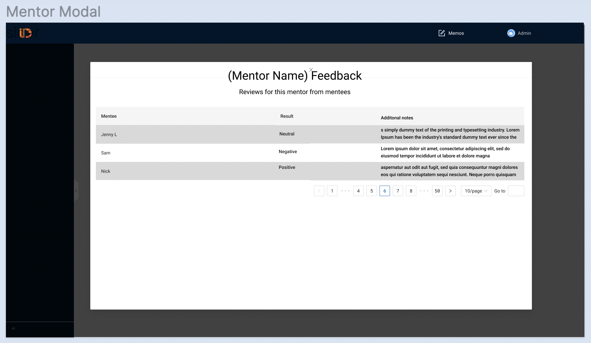

# Admin View of Aggregated Mentor Feedback

To allow administrator users to see what feedback mentors are receiving from mentees, we created two Figma mocks.

The initial wireframe included stars and showed both views.

Here's the first Figma mock showing the Mentor Feedback view where mentors are listed one per row with a summary of the feedback they have received from mentees.

Here's the second Figma mock showing the Mentor Modal view where a modal pops up when the administrator clicks on one mentor row in the Mentor Feedback view. The modal displays a table with three columns and as many rows as needed (one per mentee review) with each row representing one mentee review of that mentor.

